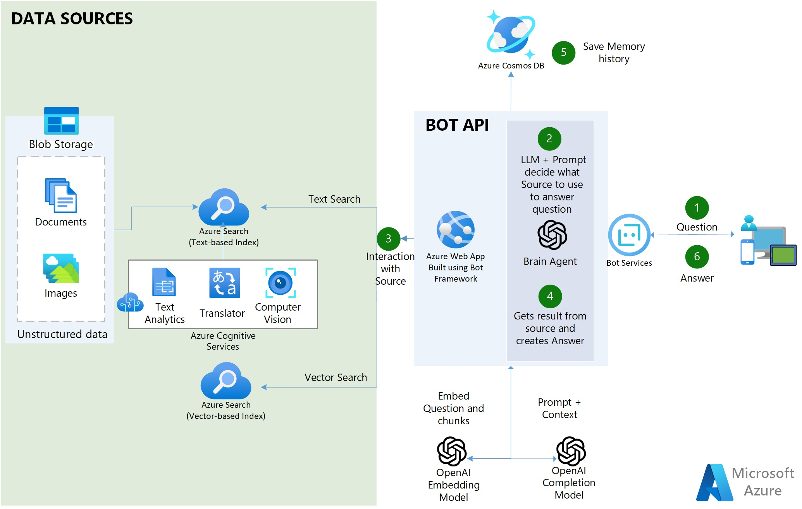

# Azure OpenAI Workbench powered by: Azure AI Search + Azure OpenAI + Bot Framework + Langchain + CosmosDB + Document Intelligence SDK

<span style="color:red">*※ The below need to be udated.*</span><br>
[](https://codespaces.new/MSUSAzureAccelerators/Azure-Cognitive-Search-Azure-OpenAI-Accelerator?quickstart=1)
[](https://vscode.dev/redirect?url=vscode://ms-vscode-remote.remote-containers/cloneInVolume?url=https://github.com/MSUSAzureAccelerators/Azure-Cognitive-Search-Azure-OpenAI-Accelerator)

Your organization requires a Multi-Channel Smart Chatbot and a search engine capable of comprehending diverse types of data scattered across various locations. Additionally, the conversational chatbot should be able to provide answers to inquiries, along with the source and an explanation of how and where the answer was obtained. In other words, you want **private and secured ChatGPT for your organization that can interpret, comprehend, and answer questions about your business data**.

The goal of the Workbench is to provide the instruction for building a use-case quickly and show/prove the value of a use-case built with Azure Services, with your own data in your own environment. The deliverables are:

1. Backend Bot API built with Bot Framework and exposed to multiple channels (Web Chat, MS Teams, SMS, Email, Slack, etc)
2. Frontend web application with a Search and a Bot UI.

The repo is made to teach you step-by-step on how to build a <span style="color:red">OpenAI-based Smart Search Engine.</span> Each Notebook builds on top of each other and ends in building the two applications.

---
**Prerequisites Client 2 Weeks POC**
* Azure subscription
* Accepted Application to Azure Open AI, including GPT-4. <span style="color:red">If customer does not have GPT-4 approved, SK C&C can lend theirs during the workshop</span>
* SK C&C members preferably to be added as Guests in clients Azure AD. If not possible, then customers can issue corporate IDs to SK C&C members
* A Resource Group (RG)  needs to be set for <span style="color:red">this Workshop POC</span>, in the customer Azure tenant
* The customer team and the SK C&C team must have Contributor permissions to this resource group so they can set everything up 5 weeks prior to <span style="color:red">the workshop</span>
* A storage account must be set in place in the RG.
* Customer Data/Documents must be uploaded to the blob storage account, at least two weeks prior to <span style="color:red">the workshop date</span>
* A Multi-Tenant App Registration (Service Principal) must be created by the customer (save the Client Id and Secret Value).
* Customer must provide the SK C&C Team , 10-20 questions (easy to hard) that they want the bot to respond correctly.
* For IDE collaboration and standarization during <span style="color:red">workshop</span>, AML compute instances with Jupyper Lab will be used, for this, Azure Machine Learning Workspace must be deployed in the RG
   * Note: Please ensure you have enough core compute quota in your Azure Machine Learning workspace 

---
# Architecture 
<span style="color:red">*※ The below need to be udated.*</span><br>


## Flow
1. The user asks a question.
2. In the app, an OpenAI GPT-4 LLM uses a clever prompt to determine which source to use based on the user input
3. Five types of sources are available:
   * 3a. Azure AI Search - contains AI-enriched documents from Blob Storage:
       - 11 Employee Handbook of Contoso Electronics PDF
       - 4 Plan and Benefit Packages of Contoso Electronics PDF
       - 109 Northwind Health Plus Plan PDF
       - 104 Northwind Health Standard Plan
       - 4 PerksPlus Health and Wellness Reimbursement Program for Contoso Electronics Employees PDF
       - 31 Roles Descriptions at Contoso Electronics PDF
4. The app retrieves the result from the source and crafts the answer.
5. The tuple (Question and Answer) is saved to CosmosDB as persistent memory and for further analysis.
6. The answer is delivered to the user.

---
## Demo
<span style="color:red">*※ The below need to be udated.*</span><br>
https://webapp-frontend-2znp775rdhyvo.azurewebsites.net/


---

## 🔧**Features**

   - Uses [Bot Framework](https://dev.botframework.com/) and [Bot Service](https://azure.microsoft.com/en-us/products/bot-services/) to Host the Bot API Backend and to expose it to multiple channels including MS Teams.
   - 100% Python.
   - Uses [Azure AI Services](https://azure.microsoft.com/en-us/products/cognitive-services/) to index and enrich unstructured documents: OCR over images, Chunking and automated vectorization.
   - Uses Hybrid Search Capabilities of Azure AI Search to provide the best semantic answer (Text and Vector search combined).
   - Uses [LangChain](https://langchain.readthedocs.io/en/latest/) as a wrapper for interacting with Azure OpenAI , vector stores, constructing prompts and creating agents.
   - Multi-Lingual (ingests, indexes and understand any language)
   - Multi-Index -> multiple search indexes
   - Uses [Azure AI Document Intelligence SDK (former Form Recognizer)](https://learn.microsoft.com/en-us/azure/ai-services/document-intelligence/overview?view=doc-intel-3.0.0) to parse complex/large PDF documents
   - Uses CosmosDB as persistent memory to save user's conversations.
   - Uses [Streamlit](https://streamlit.io/) to build the Frontend web application in python.
   

---

## **Steps to Run the POC/Accelerator**

Note: (Pre-requisite) You need to have an Azure OpenAI service already created

1. Fork this repo to your Github account.
2. In Azure OpenAI studio, deploy these models (older models than the ones stated below won't work):
   - "gpt-35-turbo-1106 (or newer)" 
   - "gpt-4-turbo-1106  (or newer)"
   - "text-embedding-ada-002 (or newer)"
3. Create a Resource Group where all the assets of this accelerator are going to be. Azure OpenAI can be in different RG or a different Subscription.
4. ClICK BELOW to create all the Azure Infrastructure needed to run the Notebooks (Azure AI Search, Azure AI Services, etc):

<span style="color:red">*※ The below need to be udated.*</span><br>
[](https://portal.azure.com/#create/Microsoft.Template/uri/https%3A%2F%2Fraw.githubusercontent.com%2Fpablomarin%2FGPT-Azure-Search-Engine%2Fmain%2Fazuredeploy.json) 

**Note**: If you have never created a `Azure AI Services Multi-Service account` before, please create one manually in the azure portal to read and accept the Responsible AI terms. Once this is deployed, delete this and then use the above deployment button.

5. Clone your Forked repo to your AML Compute Instance. If your repo is private, see below in Troubleshooting section how to clone a private repo.

6. Make sure you run the notebooks on a **Python 3.10 conda enviroment** or newer
7. Install the dependencies on your machine (make sure you do the below pip comand on the same conda environment that you are going to run the notebooks. For example, in AZML compute instance run:
```
conda activate azureml_py310_sdkv2
pip install -r ./common/requirements.txt
```

You might get some pip dependancies errors, but that is ok, the libraries were installed correctly regardless of the error.

8. Edit the file `credentials.env` with your own values from the services created in step 4.
9. **Run the Notebooks in order**. They build up on top of each other.

---

<details>

<summary>FAQs</summary>
  
## **FAQs**

1. **Why use Azure AI Search engine to provide the context for the LLM and not fine tune the LLM instead?**

A: Quoting the [OpenAI documentation](https://platform.openai.com/docs/guides/fine-tuning): "GPT-3 has been pre-trained on a vast amount of text from the open internet. When given a prompt with just a few examples, it can often intuit what task you are trying to perform and generate a plausible completion. This is often called "few-shot learning.
Fine-tuning improves on few-shot learning by training on many more examples than can fit in the prompt, letting you achieve better results on a wide number of tasks. Once a model has been fine-tuned, you won't need to provide examples in the prompt anymore. This **saves costs and enables lower-latency requests**"

However, fine-tuning the model requires providing hundreds or thousands of Prompt and Completion tuples, which are essentially query-response samples. The purpose of fine-tuning is not to give the LLM knowledge of the company's data but to provide it with examples so it can perform tasks really well without requiring examples on every prompt.

There are cases where fine-tuning is necessary, such as when the examples contain proprietary data that should not be exposed in prompts or when the language used is highly specialized, as in healthcare, pharmacy, or other industries or use cases where the language used is not commonly found on the internet.
</details>

<details>

<summary>Troubleshooting</summary>
  
## Troubleshooting

Steps to clone a private repo:
- On your Terminal, Paste the text below, substituting in your GitHub email address. [Generate a new SSH key](https://docs.github.com/en/authentication/connecting-to-github-with-ssh/generating-a-new-ssh-key-and-adding-it-to-the-ssh-agent#generating-a-new-ssh-key).
```bash
ssh-keygen -t ed25519 -C "your_email@example.com"
```
- Copy the SSH public key to your clipboard. [Add a new SSH key](https://docs.github.com/en/authentication/connecting-to-github-with-ssh/generating-a-new-ssh-key-and-adding-it-to-the-ssh-agent#generating-a-new-ssh-key).
```bash
cat ~/.ssh/id_ed25519.pub
# Then select and copy the contents of the id_ed25519.pub file
# displayed in the terminal to your clipboard
```
- On GitHub, go to **Settings-> SSH and GPG Keys-> New SSH Key**
- In the "Title" field, add a descriptive label for the new key. "AML Compute". In the "Key" field, paste your public key.
- Clone your private repo
```bash
git clone git@github.com:YOUR-USERNAME/YOUR-REPOSITORY.git
```
</details>

## Contributing
<span style="color:red">*※ The below need to be udated.*</span><br>
This project welcomes contributions and suggestions.  Most contributions require you to agree to a
Contributor License Agreement (CLA) declaring that you have the right to, and actually do, grant us
the rights to use your contribution. For details, visit https://cla.opensource.microsoft.com.

When you submit a pull request, a CLA bot will automatically determine whether you need to provide
a CLA and decorate the PR appropriately (e.g., status check, comment). Simply follow the instructions
provided by the bot. You will only need to do this once across all repos using our CLA.

This project has adopted the [Microsoft Open Source Code of Conduct](https://opensource.microsoft.com/codeofconduct/).
For more information see the [Code of Conduct FAQ](https://opensource.microsoft.com/codeofconduct/faq/) or
contact [opencode@microsoft.com](mailto:opencode@microsoft.com) with any additional questions or comments.

## Trademarks
<span style="color:red">*※ The below need to be udated.*</span><br>
This project may contain trademarks or logos for projects, products, or services. Authorized use of Microsoft 
trademarks or logos is subject to and must follow 
[Microsoft's Trademark & Brand Guidelines](https://www.microsoft.com/en-us/legal/intellectualproperty/trademarks/usage/general).
Use of Microsoft trademarks or logos in modified versions of this project must not cause confusion or imply Microsoft sponsorship.
Any use of third-party trademarks or logos are subject to those third-party's policies.

